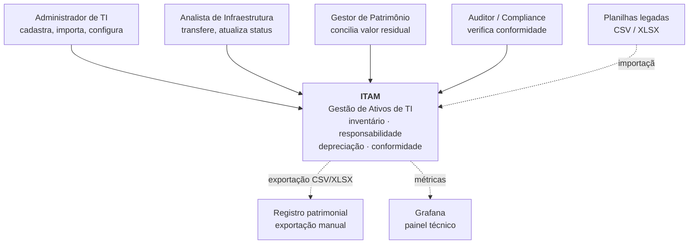
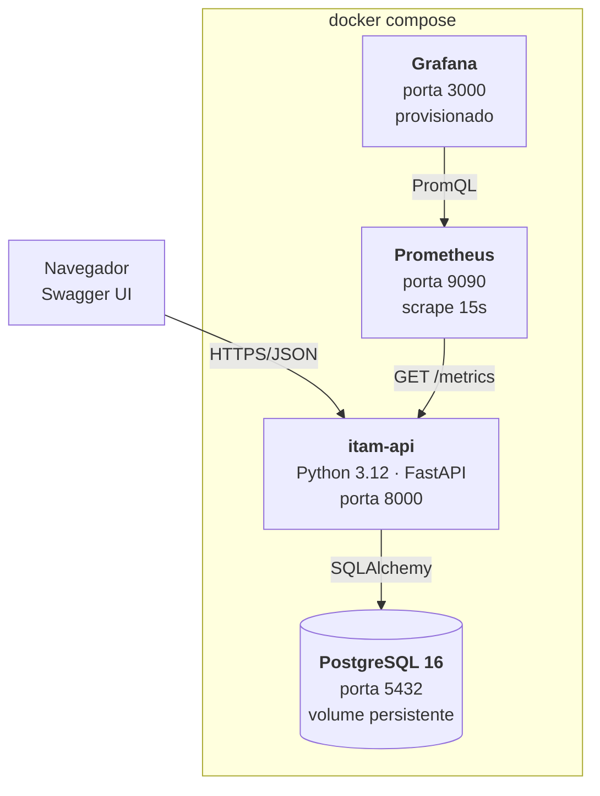
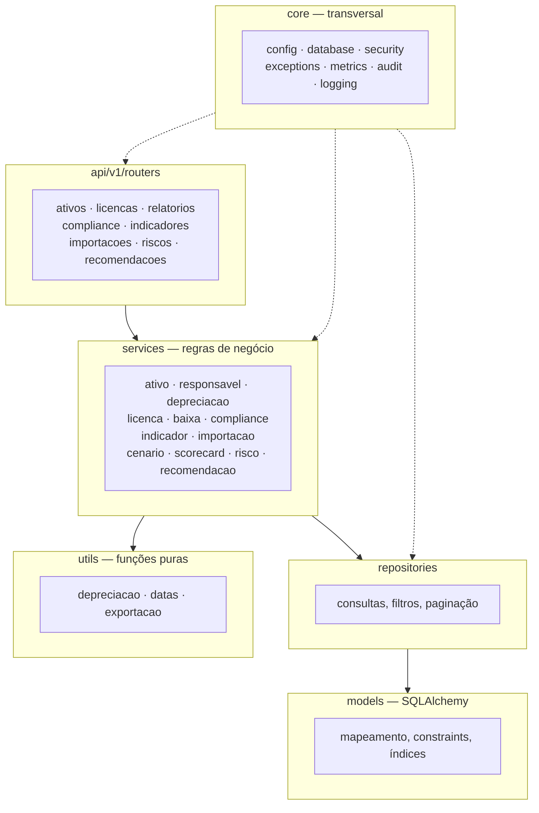
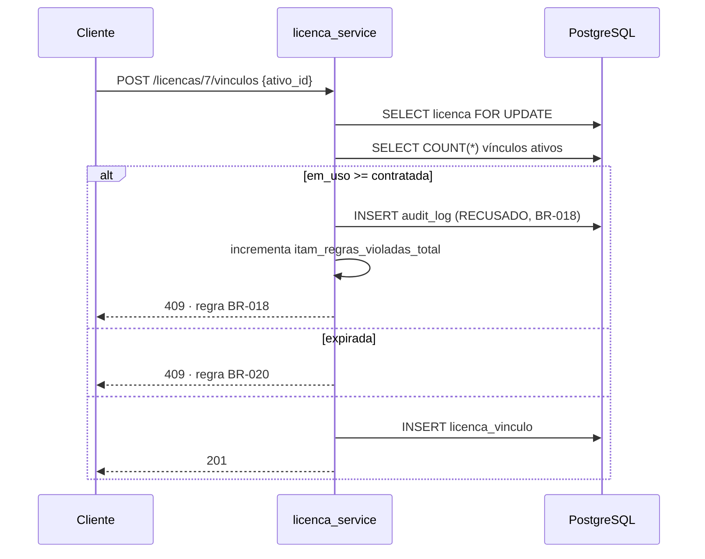

# Arquitetura — ITAM

Visão de arquitetura do MVP de Gestão de Ativos de TI. Complementa o [`SPEC.md`](SPEC.md), que detalha implementação, e o [`PRD.md`](PRD.md), que define o produto.

---

## 1. Direcionadores arquiteturais

A arquitetura responde a cinco forças, em ordem de peso:

| # | Direcionador | Origem | Consequência arquitetural |
|---|---|---|---|
| D1 | O histórico é evidência de auditoria e não pode ser alterado | NFR-AUD-01, Persona Diego | Tabelas *append-only* com garantia no banco, não em convenção de código |
| D2 | O valor residual precisa conciliar com a contabilidade | KPI-05, Persona Rosângela | `Decimal` em toda cadeia, cálculo determinístico e auditável |
| D3 | Nenhuma decisão sem evidência verificável | BR-027, princípio da disciplina | Recomendação e evidência criadas na mesma transação |
| D4 | O ambiente precisa subir em qualquer máquina, sem dependência externa | Avaliação, RI-10 | Perfil local com SQLite, perfil orquestrado com PostgreSQL |
| D5 | A API é o contrato, independentemente da linguagem | NFR-MAN-01 | OpenAPI congelado e testes de contrato separados dos de integração |

---

## 2. Contexto



**Fronteira do sistema.** O ITAM não lê o parque diretamente: não há agente, não há AD, não há SCCM. Ele opera sobre dados informados ou importados. Essa fronteira é deliberada e está registrada em OUT-01 a OUT-03 do PRD — o produto é uma camada de governança, não um simulador de infraestrutura.

---

## 3. Contêineres



| Contêiner | Responsabilidade | Estado |
|---|---|---|
| `itam-api` | Toda a lógica de negócio e a exposição da API | Sem estado — reiniciável a qualquer momento |
| `postgres` | Persistência, invariantes e imutabilidade | Volume nomeado, único estado do sistema |
| `prometheus` | Coleta e retenção de métricas | Volume próprio, descartável |
| `grafana` | Visualização técnica | Provisionamento declarativo em `infra/grafana/` |

**Perfis de execução.** `docker compose --profile local` sobe apenas a API com SQLite, para desenvolvimento e para a hipótese de o ambiente da apresentação falhar (RI-10). O perfil padrão sobe os quatro contêineres.

---

## 4. Componentes da API



### Regra de dependência

A seta aponta em um sentido só. Violações comuns a evitar:

| Anti-padrão | Por que quebra |
|---|---|
| Router com `if` de regra de negócio | A regra deixa de ser testável sem HTTP e some da matriz de rastreabilidade |
| Serviço importando outro router | Cria ciclo e acopla negócio a transporte |
| Repositório decidindo o que é válido | A regra se espalha; duas regras divergentes sobre o mesmo fato |
| Modelo com lógica de cálculo | Impede testar o cálculo sem sessão de banco |

**`utils/` é a camada mais protegida.** Funções puras, sem sessão, sem `date.today()` interno, sem I/O. É onde vive a depreciação — e é por isso que os critérios AC-015 a AC-020 são testáveis sem subir banco nem manipular relógio.

---

## 5. Fluxos críticos

### 5.1 Transferência de responsável

O ponto delicado: a operação parece um UPDATE seguido de um INSERT, mas precisa ser atômica e respeitar uma tabela imutável.

```mermaid
sequenceDiagram
    participant C as Cliente
    participant R as Router
    participant S as responsavel_service
    participant DB as PostgreSQL

    C->>R: POST /ativos/12/responsavel
    R->>R: valida payload (Pydantic)
    R->>S: transferir(ativo_id, dados, usuario)
    S->>DB: SELECT ativo FOR UPDATE
    alt status = BAIXADO
        S-->>C: 409 · regra BR-009
    end
    S->>S: valida data_inicio ≥ data_aquisicao (BR-010)
    rect rgb(40,48,64)
    note over S,DB: transação única
    S->>DB: UPDATE vínculo aberto SET data_fim
    S->>DB: INSERT novo vínculo (data_fim NULL)
    S->>DB: INSERT audit_log
    end
    DB-->>S: commit
    S-->>C: 201 + linha do tempo
```



O `SELECT ... FOR UPDATE` e o índice único parcial `ux_vinculo_aberto` são redundantes de propósito: o lock evita a corrida no caminho feliz, o índice garante a invariante mesmo se alguém contornar o serviço.

### 5.2 Vinculação de licença com bloqueio



**A recusa é um evento de negócio, não um erro técnico.** Ela é registrada na auditoria e conta na métrica `itam_regras_violadas_total`. Na defesa, esse contador no Grafana é a prova de que o sistema está governando, e não apenas armazenando.

---

## 6. Implantação

```
docker-compose.yml
├── itam-api        depends_on: db (service_healthy)
│                   healthcheck: GET /health
│                   env_file: .env
├── db              image: postgres:16-alpine
│                   healthcheck: pg_isready
│                   volume: itam_pgdata
├── prometheus      config: infra/prometheus.yml
│                   volume: itam_promdata
└── grafana         provisioning: infra/grafana/
                    volume: itam_grafanadata
```

**Ordem de inicialização garantida por health check**, não por `sleep`. A API só inicia depois que o Postgres responde a `pg_isready`, e o Prometheus só coleta depois que `/health` retorna 200.

**Migrações** rodam no start da API via entrypoint (`alembic upgrade head`), nunca `create_all()`. A carga de demonstração é separada, em `scripts/seed.sh`, para que o ambiente possa subir vazio.

---

## 7. Aspectos transversais

| Aspecto | Decisão | Onde vive |
|---|---|---|
| **Configuração** | Pydantic Settings, tudo por variável de ambiente; aplicação recusa iniciar com `SECRET_KEY` padrão fora do perfil local | `core/config.py` |
| **Segurança** | JWT HS256, BCrypt custo ≥ 10, RBAC por dependência de rota, nenhum perfil com DELETE de domínio | `core/security.py`, `api/deps.py` |
| **Erros** | Payload único inspirado na RFC 7807, com campo `regra` apontando para o identificador do PRD | `core/exceptions.py` |
| **Auditoria** | Escrita em `audit_log` dentro da mesma transação da operação, incluindo recusas | `core/audit.py` |
| **Observabilidade** | Middleware de métricas, log estruturado JSON com `request_id` | `core/metrics.py`, `core/logging.py` |
| **Transações** | Uma unidade de trabalho por requisição; serviços compõem dentro dela, nunca abrem a própria | `core/database.py` |

### O campo `regra` no erro

```json
{ "status": 409, "detalhe": "...", "regra": "BR-018", "instancia": "/api/v1/licencas/7/vinculos" }
```

Essa escolha conecta o comportamento em tempo de execução ao documento de requisitos. O efeito prático: durante a defesa, uma recusa da API pode ser rastreada até a regra e daí até o critério de aceite e o teste que a cobre, sem abrir o código.

---

## 8. Atributos de qualidade

| Atributo | Tática arquitetural | Verificação |
|---|---|---|
| Integridade do histórico | Trigger de bloqueio de UPDATE/DELETE no banco | AC-013, teste de integração |
| Consistência sob concorrência | Índice único parcial + `SELECT FOR UPDATE` | Teste com requisições paralelas |
| Precisão contábil | `Decimal` + `Numeric(12,2)`, arredondamento half-up explícito | AC-015, conciliação manual |
| Testabilidade | Cálculo como função pura com data injetada | 100% de cobertura em `utils/` |
| Portabilidade | Enums como VARCHAR + CHECK; sem tipos exclusivos do Postgres | Suíte roda em SQLite e PostgreSQL |
| Intercambialidade de implementação | OpenAPI congelado + testes de contrato | Contrato passa em qualquer stack |
| Operabilidade | Health check, métricas, smoke test, scripts de ciclo de vida | `scripts/smoke_test.sh` |

---

## 9. O que a arquitetura deliberadamente não faz

| Não faz | Por quê | Custo aceito |
|---|---|---|
| Não persiste depreciação | Evita job de recálculo e divergência com a data corrente | Cálculo repetido em toda consulta |
| Não guarda `responsavel_id` no ativo | Evita fonte de verdade concorrente com o histórico | Join adicional para obter o responsável atual |
| Não materializa `quantidade_em_uso` | Evita dessincronização silenciosa | `COUNT` a cada consulta de licença |
| Não separa em microsserviços | Escopo de MVP; custo operacional sem benefício | Escala vertical apenas |
| Não processa importação de forma assíncrona | Sem fila, sem worker, sem estado intermediário | Limite de 5.000 linhas por arquivo |

Cada uma dessas trocas é uma ADR registrada em `docs/adr/` e deve ser defensável oralmente. São elas que diferenciam uma arquitetura decidida de uma arquitetura acidental.

---

## 10. Evolução

| Fase | Mudança arquitetural |
|---|---|
| V2 — anexos e QR Code | Introduz armazenamento de objetos (MinIO ou sistema de arquivos com metadados no banco) |
| V2 — notificações | Introduz agendador para varrer alertas e disparar e-mail; primeiro componente com execução fora do ciclo de requisição |
| V3 — agente de inventário | Introduz ingestão assíncrona: fila, worker e reconciliação entre o inventário declarado e o descoberto |
| V3 — integração com AD | Autenticação deixa de ser local; `usuario` e `responsavel` passam a ser projeções de uma fonte externa |

A V3 é a primeira que quebra a premissa P1 (monólito modular). Antes dela, o crescimento é por módulo dentro do mesmo processo.