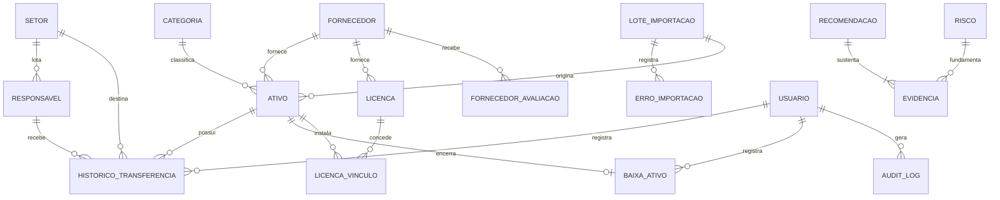

# Modelo de Dados — ITAM

Modelo lógico e físico do MVP de Gestão de Ativos de TI. Referencia as regras `BR-` do [`PRD.md`](PRD.md) e detalha o que o [`SPEC.md`](SPEC.md) resume.

---

## 1. Diagrama de Entidade-Relacionamento



A cardinalidade `RECOMENDACAO ||--|{ EVIDENCIA` é **um para um-ou-muitos**, não um para zero-ou-muitos. Essa é a expressão no modelo da regra BR-027: recomendação sem evidência não existe.

---

## 2. Enumerações

| Enum | Valores | Usado em |
|---|---|---|
| `tipo_ativo` | `HARDWARE`, `SOFTWARE` | `ativo.tipo`, `categoria.tipo_aplicavel` |
| `status_ativo` | `ATIVO`, `EM_MANUTENCAO`, `BAIXADO` | `ativo.status` |
| `motivo_baixa` | `OBSOLESCENCIA`, `DEFEITO`, `FURTO_ROUBO`, `FIM_VIDA_UTIL`, `OUTRO` | `baixa_ativo.motivo` |
| `destinacao_baixa` | `RECICLAGEM_CERTIFICADA`, `DOACAO`, `DEVOLUCAO_FORNECEDOR`, `VENDA`, `DESCARTE` | `baixa_ativo.destinacao` |
| `tipo_licenciamento` | `PERPETUA`, `SUBSCRICAO`, `OEM` | `licenca.tipo_licenciamento` |
| `perfil_usuario` | `ADMIN`, `OPERADOR`, `GESTOR`, `AUDITOR` | `usuario.perfil` |
| `categoria_risco` | `OPERACIONAL`, `FINANCEIRO`, `LEGAL`, `SEGURANCA`, `CONTINUIDADE` | `risco.categoria` |
| `resposta_risco` | `ACEITAR`, `MITIGAR`, `TRANSFERIR`, `EVITAR` | `risco.resposta` |
| `status_recomendacao` | `PROPOSTA`, `APROVADA`, `REJEITADA`, `IMPLEMENTADA` | `recomendacao.status` |
| `tipo_evidencia` | `INDICADOR`, `RISCO`, `ATIVO`, `LICENCA`, `SCORECARD`, `CENARIO`, `PREMISSA` | `evidencia.tipo` |

Todos implementados como `VARCHAR` com `CHECK`, nunca como `ENUM` nativo do PostgreSQL (ADR-007): enums nativos exigem migração dedicada para cada valor novo e não existem no SQLite.

---

## 3. Dicionário de dados

### 3.1 `categoria`

| Coluna | Tipo | Nulo | Padrão | Descrição |
|---|---|---|---|---|
| `id` | BIGINT | não | identity | Chave primária |
| `nome` | VARCHAR(80) | não | — | Único. Ex.: "Notebook", "Servidor" |
| `descricao` | VARCHAR(255) | sim | — | Texto livre |
| `vida_util_meses` | INTEGER | não | — | `CHECK > 0`. Base da depreciação |
| `tipo_aplicavel` | VARCHAR(10) | não | — | `HARDWARE` ou `SOFTWARE` |
| `ativa` | BOOLEAN | não | `true` | Desativação lógica |

### 3.2 `fornecedor`

| Coluna | Tipo | Nulo | Descrição |
|---|---|---|---|
| `id` | BIGINT | não | PK |
| `razao_social` | VARCHAR(160) | não | — |
| `cnpj` | VARCHAR(18) | sim | Único quando presente |
| `contato`, `telefone`, `email` | VARCHAR | sim | Dados de contato |
| `ativo` | BOOLEAN | não | Padrão `true` |

### 3.3 `setor` e `responsavel`

| `setor` | Tipo | Descrição |
|---|---|---|
| `id` | BIGINT | PK |
| `nome` | VARCHAR(120) | Único |
| `sigla` | VARCHAR(12) | — |
| `ativo` | BOOLEAN | Padrão `true` |

| `responsavel` | Tipo | Descrição |
|---|---|---|
| `id` | BIGINT | PK |
| `nome` | VARCHAR(160) | — |
| `matricula` | VARCHAR(30) | Único quando presente |
| `email`, `cargo` | VARCHAR | — |
| `setor_id` | BIGINT | FK → `setor`. Lotação atual, independente do setor do vínculo |
| `ativo` | BOOLEAN | Desligamento é desativação, nunca exclusão |

> `responsavel.setor_id` é a lotação da pessoa; `historico_transferencia.setor_id` é o setor que respondeu pelo ativo naquele período. São campos distintos de propósito: uma pessoa muda de setor sem que o histórico do ativo seja reescrito.

### 3.4 `ativo`

| Coluna | Tipo | Nulo | Regra | Descrição |
|---|---|---|---|---|
| `id` | BIGINT | não | — | PK |
| `nome` | VARCHAR(120) | não | `CHECK length ≥ 3` | Identificação humana |
| `tipo` | VARCHAR(10) | não | enum | `HARDWARE` ou `SOFTWARE` |
| `categoria_id` | BIGINT | não | BR-005 | FK |
| `fornecedor_id` | BIGINT | não | BR-005 | FK |
| `numero_serie` | VARCHAR(80) | sim | BR-001, BR-002 | **Único**, inclusive entre baixados |
| `chave_licenca` | VARCHAR(200) | sim | BR-002 | Mascarada fora do perfil ADMIN |
| `data_aquisicao` | DATE | não | BR-003 | Não futura |
| `valor_compra` | NUMERIC(12,2) | não | BR-004 | `CHECK > 0` |
| `vida_util_meses` | INTEGER | não | BR-006 | Herdada da categoria, sobrescrevível |
| `status` | VARCHAR(20) | não | — | Padrão `ATIVO` |
| `localizacao` | VARCHAR(120) | sim | — | Texto livre |
| `observacoes` | VARCHAR(500) | sim | — | — |
| `lote_importacao_id` | BIGINT | sim | — | Procedência; nulo em cadastro manual |
| `criado_em`, `atualizado_em` | TIMESTAMPTZ | não | — | UTC |

```sql
CONSTRAINT ck_ativo_identificador CHECK (
  (tipo = 'HARDWARE' AND numero_serie IS NOT NULL) OR
  (tipo = 'SOFTWARE' AND chave_licenca  IS NOT NULL)
)
```

**Não existe coluna `responsavel_id`** (ADR-003) nem colunas de depreciação (ADR-002). Ambos são derivados — ver seção 6.

### 3.5 `historico_transferencia` — *append-only*

| Coluna | Tipo | Nulo | Descrição |
|---|---|---|---|
| `id` | BIGINT | não | PK |
| `ativo_id` | BIGINT | não | FK |
| `responsavel_id` | BIGINT | não | FK |
| `setor_id` | BIGINT | não | FK. Setor no momento do vínculo |
| `data_inicio` | DATE | não | ≥ `ativo.data_aquisicao` (BR-010) |
| `data_fim` | DATE | **sim** | **Nulo = vínculo vigente** |
| `motivo` | VARCHAR(200) | sim | Texto livre |
| `registrado_por_id` | BIGINT | não | FK → `usuario` |
| `criado_em` | TIMESTAMPTZ | não | — |

```sql
CONSTRAINT ck_periodo CHECK (data_fim IS NULL OR data_fim >= data_inicio)
```

### 3.6 `baixa_ativo` — *append-only*

| Coluna | Tipo | Nulo | Regra |
|---|---|---|---|
| `id` | BIGINT | não | PK |
| `ativo_id` | BIGINT | não | FK, **UNIQUE** (BR-024) |
| `motivo` | VARCHAR(20) | não | enum |
| `justificativa` | VARCHAR(500) | sim | Obrigatória se `motivo = OUTRO` (BR-023) |
| `data_baixa` | DATE | não | Não futura, ≥ aquisição (BR-022) |
| `destinacao` | VARCHAR(30) | não | BR-026 — evidência de TI Verde |
| `valor_residual_baixa` | NUMERIC(12,2) | não | `CHECK ≥ 0`. Congelado (BR-015) |
| `registrado_por_id` | BIGINT | não | FK |
| `criado_em` | TIMESTAMPTZ | não | — |

```sql
CONSTRAINT ck_baixa_justificativa CHECK (
  motivo <> 'OUTRO' OR (justificativa IS NOT NULL AND length(justificativa) >= 10)
)
```

O `UNIQUE` em `ativo_id` é o que torna BR-024 ("ativo já baixado não pode ser baixado de novo") uma garantia, e não uma verificação que pode falhar sob concorrência.

### 3.7 `licenca` e `licenca_vinculo`

| `licenca` | Tipo | Regra |
|---|---|---|
| `id` | BIGINT | PK |
| `software` | VARCHAR(120) | — |
| `fornecedor_id` | BIGINT | FK |
| `chave_licenca` | VARCHAR(200) | Mascarada fora do ADMIN |
| `quantidade_contratada` | INTEGER | `CHECK ≥ 1` |
| `data_aquisicao` | DATE | Não futura |
| `data_expiracao` | DATE | `CHECK > data_aquisicao` (BR-019) |
| `valor_total` | NUMERIC(12,2) | `CHECK > 0` |
| `tipo_licenciamento` | VARCHAR(20) | enum |

| `licenca_vinculo` | Tipo | Regra |
|---|---|---|
| `id` | BIGINT | PK |
| `licenca_id` | BIGINT | FK |
| `ativo_id` | BIGINT | FK |
| `data_vinculo` | DATE | — |
| `ativo_vinculo` | BOOLEAN | Padrão `true`; desvínculo é lógico |

```sql
CREATE UNIQUE INDEX ux_licenca_ativo
  ON licenca_vinculo (licenca_id, ativo_id)
  WHERE ativo_vinculo = true;
```

**`quantidade_em_uso` não é coluna** (BR-021, ADR-008). É `COUNT(*)` sobre `licenca_vinculo` com `ativo_vinculo = true`.

### 3.8 Importação

| `lote_importacao` | Tipo |
|---|---|
| `id`, `nome_arquivo`, `data_importacao`, `usuario_id`, `total_processado`, `total_aceito`, `total_rejeitado` | — |

| `erro_importacao` | Tipo | Descrição |
|---|---|---|
| `id` | BIGINT | PK |
| `lote_id` | BIGINT | FK, CASCADE |
| `numero_linha` | INTEGER | Linha do arquivo original |
| `campo` | VARCHAR(80) | Campo que falhou |
| `valor_recebido` | VARCHAR(255) | Valor bruto, para diagnóstico |
| `motivo` | VARCHAR(255) | Mensagem legível |

### 3.9 Governança

| `risco` | Tipo | Regra |
|---|---|---|
| `probabilidade`, `impacto` | INTEGER | `CHECK BETWEEN 1 AND 5` |
| `score` | INTEGER | `GENERATED ALWAYS AS (probabilidade * impacto) STORED` |
| `categoria`, `resposta`, `status` | VARCHAR | enums |
| `titulo`, `descricao`, `gatilho` | VARCHAR | — |
| `responsavel_id`, `data_revisao` | — | — |

| `recomendacao` | `titulo`, `contexto`, `recomendacao`, `alternativas`, `responsavel_id`, `data`, `status` |
|---|---|
| `evidencia` | `id`, `recomendacao_id` (FK CASCADE), `tipo`, `referencia_id`, `descricao` |

| `fornecedor_avaliacao` | Tipo |
|---|---|
| `fornecedor_id`, `criterio`, `peso` (NUMERIC(5,2)), `nota` (NUMERIC(4,2), `CHECK 0–10`), `periodo` | — |

### 3.10 `usuario` e `audit_log`

| `usuario` | Tipo |
|---|---|
| `id`, `login` (UNIQUE), `senha_hash`, `nome`, `perfil` (enum), `ativo`, `criado_em` | — |

| `audit_log` — *append-only* | Tipo | Descrição |
|---|---|---|
| `usuario_id` | BIGINT | Autor |
| `operacao` | VARCHAR(20) | `CRIAR`, `ATUALIZAR`, `EXCLUIR`, `BLOQUEAR`, `LOGIN` |
| `entidade`, `entidade_id` | VARCHAR/BIGINT | Alvo |
| `resultado` | VARCHAR(10) | `SUCESSO` ou `RECUSADO` |
| `regra_violada` | VARCHAR(10) | Ex.: `BR-018`. Nulo em sucesso |
| `detalhe` | JSONB | Payload relevante, sem dados sensíveis |
| `carimbo` | TIMESTAMPTZ | UTC |

---

## 4. Invariantes e como são garantidas

| Invariante | Regra | Garantia | Camada |
|---|---|---|---|
| Número de série único no sistema | BR-001 | `UNIQUE` | Banco |
| Hardware tem série; software tem chave | BR-002 | `CHECK` composto | Banco |
| Um único vínculo aberto por ativo | BR-007 | Índice único parcial | **Banco** |
| Períodos de vínculo não se sobrepõem | BR-008 | Transação única + `SELECT FOR UPDATE` | Serviço + banco |
| Ativo baixado não recebe responsável | BR-009 | Verificação com lock | Serviço |
| Histórico não pode ser alterado | BR-011, BR-025 | Trigger `BEFORE UPDATE OR DELETE` | **Banco** |
| Um ativo tem no máximo uma baixa | BR-024 | `UNIQUE (ativo_id)` | Banco |
| Uso de licença ≤ contratado | BR-018 | Verificação com lock na licença | Serviço |
| Valor residual nunca negativo | BR-014 | `max(..., 0)` + `CHECK ≥ 0` na baixa | Cálculo + banco |
| Recomendação exige evidência | BR-027 | Criação na mesma transação | **Serviço** (ver abaixo) |
| Pesos do scorecard somam 100% | BR-029 | Validação com `Decimal` | Serviço |

### O caso do BR-027

É a única invariante estrutural que **não** pode ser expressa como constraint simples: exigiria verificar a existência de filhos no momento do INSERT do pai. As saídas seriam uma `CONSTRAINT TRIGGER DEFERRABLE` ou uma verificação no commit — complexidade que não se paga num MVP.

A decisão: criar `recomendacao` e suas `evidencia` na mesma transação, no serviço, e cobrir com teste de integração (AC-051). O custo aceito é que uma escrita direta no banco, contornando a API, poderia violar a regra. Aceitável porque nenhum perfil tem acesso direto ao banco.

### Imutabilidade e a exceção necessária

```sql
CREATE OR REPLACE FUNCTION bloquear_mutacao() RETURNS TRIGGER AS $$
BEGIN
  RAISE EXCEPTION 'Registro histórico é imutável (NFR-AUD-01)';
END;
$$ LANGUAGE plpgsql;

CREATE TRIGGER tg_baixa_imutavel
  BEFORE UPDATE OR DELETE ON baixa_ativo
  FOR EACH ROW EXECUTE FUNCTION bloquear_mutacao();

CREATE TRIGGER tg_audit_imutavel
  BEFORE UPDATE OR DELETE ON audit_log
  FOR EACH ROW EXECUTE FUNCTION bloquear_mutacao();
```

`historico_transferencia` precisa de tratamento próprio, porque a transferência escreve `data_fim` no vínculo anterior:

```sql
CREATE OR REPLACE FUNCTION permitir_apenas_encerramento() RETURNS TRIGGER AS $$
BEGIN
  IF TG_OP = 'DELETE' THEN
    RAISE EXCEPTION 'Vínculo histórico não pode ser excluído (BR-025)';
  END IF;
  IF OLD.data_fim IS NOT NULL THEN
    RAISE EXCEPTION 'Vínculo já encerrado é imutável (BR-011)';
  END IF;
  IF NEW.ativo_id          IS DISTINCT FROM OLD.ativo_id
  OR NEW.responsavel_id    IS DISTINCT FROM OLD.responsavel_id
  OR NEW.setor_id          IS DISTINCT FROM OLD.setor_id
  OR NEW.data_inicio       IS DISTINCT FROM OLD.data_inicio
  OR NEW.registrado_por_id IS DISTINCT FROM OLD.registrado_por_id THEN
    RAISE EXCEPTION 'Somente data_fim pode ser preenchida (BR-011)';
  END IF;
  RETURN NEW;
END;
$$ LANGUAGE plpgsql;
```

O trigger permite exatamente uma transição — nulo para não-nulo em `data_fim` — e nada mais. É a materialização da ADR-005.

---

## 5. Índices

| Tabela | Índice | Tipo | Motivo |
|---|---|---|---|
| `ativo` | `numero_serie` | único | BR-001 |
| `ativo` | `status` | btree | Filtro mais usado |
| `ativo` | `categoria_id`, `fornecedor_id` | btree | Filtros de relatório |
| `ativo` | `data_aquisicao` | btree | Faixas de período e idade |
| `ativo` | `lower(nome)` | btree | Busca textual |
| `historico_transferencia` | `(ativo_id) WHERE data_fim IS NULL` | **único parcial** | BR-007 |
| `historico_transferencia` | `(ativo_id, data_inicio DESC)` | btree | Linha do tempo |
| `historico_transferencia` | `responsavel_id` | btree | "O que está com fulano" |
| `baixa_ativo` | `ativo_id` | único | BR-024 |
| `baixa_ativo` | `data_baixa` | btree | Relatório por período |
| `licenca_vinculo` | `(licenca_id, ativo_id) WHERE ativo_vinculo` | único parcial | Evita duplicata |
| `licenca` | `data_expiracao` | btree | Varredura de vencimento |
| `audit_log` | `(entidade, entidade_id)`, `carimbo` | btree | Consulta de auditoria |

---

## 6. Consultas derivadas de referência

### Responsável atual de um ativo

```sql
SELECT r.id, r.nome, s.nome AS setor, h.data_inicio
FROM historico_transferencia h
JOIN responsavel r ON r.id = h.responsavel_id
JOIN setor s       ON s.id = h.setor_id
WHERE h.ativo_id = :ativo_id
  AND h.data_fim IS NULL;
```

### Quantidade em uso de uma licença

```sql
SELECT COUNT(*) AS quantidade_em_uso
FROM licenca_vinculo
WHERE licenca_id = :licenca_id
  AND ativo_vinculo = true;
```

### Ativos sem responsável (alerta CP-04)

```sql
SELECT a.id, a.nome, a.numero_serie
FROM ativo a
LEFT JOIN historico_transferencia h
       ON h.ativo_id = a.id AND h.data_fim IS NULL
WHERE a.status = 'ATIVO'
  AND h.id IS NULL;
```

### Depreciação em SQL (para conferência do cálculo da aplicação)

```sql
SELECT
  a.id,
  a.valor_compra,
  LEAST(
    EXTRACT(YEAR  FROM age(CURRENT_DATE, a.data_aquisicao)) * 12
  + EXTRACT(MONTH FROM age(CURRENT_DATE, a.data_aquisicao)),
    a.vida_util_meses
  )::int AS meses_efetivos,
  ROUND(a.valor_compra / a.vida_util_meses, 2) AS depreciacao_mensal
FROM ativo a
WHERE a.status <> 'BAIXADO';
```

Esta consulta existe para **conferir** o resultado da aplicação, não para substituí-lo. A fonte de verdade do cálculo é `app/utils/depreciacao.py` (ADR-002); divergência entre os dois indica bug e deve virar teste.

### Licenças não conformes (CP-01 e CP-02)

```sql
SELECT l.id, l.software, l.quantidade_contratada,
       COUNT(v.id) FILTER (WHERE v.ativo_vinculo) AS em_uso,
       l.data_expiracao,
       CASE
         WHEN l.data_expiracao < CURRENT_DATE THEN 'CP-01'
         WHEN COUNT(v.id) FILTER (WHERE v.ativo_vinculo) > l.quantidade_contratada THEN 'CP-02'
       END AS alerta
FROM licenca l
LEFT JOIN licenca_vinculo v ON v.licenca_id = l.id
GROUP BY l.id
HAVING l.data_expiracao < CURRENT_DATE
    OR COUNT(v.id) FILTER (WHERE v.ativo_vinculo) > l.quantidade_contratada;
```

---

## 7. Dados semente

Carregados por `scripts/seed.sh`, obrigatórios para o sistema funcionar:

### Categorias (vida útil conforme IN RFB nº 1.700/2017)

| Nome | Tipo | Vida útil (meses) |
|---|---|---|
| Notebook | HARDWARE | 60 |
| Desktop | HARDWARE | 60 |
| Servidor | HARDWARE | 60 |
| Monitor | HARDWARE | 60 |
| Switch | HARDWARE | 60 |
| Roteador | HARDWARE | 60 |
| Impressora | HARDWARE | 48 |
| Smartphone | HARDWARE | 36 |
| Tablet | HARDWARE | 36 |
| Nobreak | HARDWARE | 60 |
| Software perpétuo | SOFTWARE | 60 |

### Usuários de demonstração

Um por perfil — `admin`, `operador`, `gestor`, `auditor` — com senhas definidas em `.env`, para uso exclusivo em laboratório.

---

## 8. Datasets de demonstração

Os datasets do projeto anterior (`alertas.csv`, `slos.csv`, `dashboard_referencia.csv` no formato de observabilidade) **não têm equivalência neste modelo** e devem ser substituídos. O mapeamento novo:

| Arquivo | Tabela destino | Volume sugerido | Gate |
|---|---|---|---|
| `categorias.csv` | `categoria` | 11 | Gate 1 |
| `fornecedores.csv` | `fornecedor` | 12 | Gate 1 |
| `setores.csv` | `setor` | 8 | Gate 1 |
| `responsaveis.csv` | `responsavel` | 60 | Gate 2 |
| `inventario.csv` | `ativo` | 300 | Gate 1 |
| `inventario_com_erros.csv` | `ativo` | 100 (8 inválidas) | Gate 1 |
| `transferencias.csv` | `historico_transferencia` | 450 | Gate 2 |
| `licencas.csv` | `licenca` | 25 | Gate 3 |
| `licenca_vinculos.csv` | `licenca_vinculo` | 380 | Gate 3 |
| `baixas.csv` | `baixa_ativo` | 40 | Gate 3 |
| `riscos.csv` | `risco` | 15 | Gate 4 |
| `custos_cenarios.csv` | entrada de `/cenarios/comparar` | 3 cenários | Gate 4 |

### Desvios plantados deliberadamente

O dataset só demonstra governança se contiver desconformidade. Ao gerá-lo, plantar:

| Situação | Quantidade | Alerta que dispara |
|---|---|---|
| Licença vencida | 2 | CP-01 |
| Licença com uso acima do contratado | 1 | CP-02 |
| Licença expirando em ≤ 30 dias | 3 | CP-03 |
| Ativo ativo sem vínculo de responsável | 12 | CP-04 |
| Ativo 100% depreciado ainda em operação | 18 | CP-05 |
| Ativo em manutenção há mais de 90 dias | 4 | CP-06 |
| Baixa sem destinação (para validar a recusa) | — | CP-07 |
| Ativo sem movimentação há mais de 12 meses | 25 | CP-08 |
| Licença subutilizada (uso ≤ 50%) | 3 | Alerta Baixo |

Sem esses desvios o painel de compliance aparece vazio na defesa, e um painel vazio não prova que a regra funciona — prova apenas que ninguém a testou.

### Coerência exigida do dataset

- Toda `data_inicio` de transferência ≥ `data_aquisicao` do ativo (BR-010);
- Nenhum ativo com dois vínculos abertos (BR-007);
- Todo ativo em `baixas.csv` com status `BAIXADO` em `inventario.csv`;
- Nenhum vínculo de responsável iniciando após a data de baixa;
- `data_expiracao` > `data_aquisicao` em toda licença (BR-019);
- Números de série únicos no arquivo inteiro (BR-001).

Um gerador em Python é preferível a planilha manual: mantém a coerência referencial e permite regenerar com semente fixa, o que torna a demonstração reprodutível.

---

## 9. Migrações

| Migração | Conteúdo |
|---|---|
| `0001_base` | `categoria`, `fornecedor`, `setor`, `responsavel`, `usuario` |
| `0002_ativo` | `ativo` com constraints e índices |
| `0003_historico` | `historico_transferencia`, índice único parcial, trigger de encerramento |
| `0004_baixa` | `baixa_ativo`, `UNIQUE (ativo_id)`, trigger de imutabilidade |
| `0005_licenca` | `licenca`, `licenca_vinculo`, índice parcial |
| `0006_importacao` | `lote_importacao`, `erro_importacao`, FK em `ativo` |
| `0007_governanca` | `risco`, `recomendacao`, `evidencia`, `fornecedor_avaliacao` |
| `0008_auditoria` | `audit_log`, trigger de imutabilidade, índices |

Toda migração precisa de `downgrade` funcional e testado. Triggers e funções são criados e removidos na própria migração, nunca por script externo — do contrário o ambiente do professor diverge do da equipe no primeiro `alembic upgrade head`.

**Compatibilidade com SQLite:** triggers em PL/pgSQL não existem no SQLite. No perfil local, a imutabilidade cai para a camada de serviço. Os testes que validam AC-013 devem rodar contra PostgreSQL — marcá-los com `@pytest.mark.postgres` e executá-los no CI, não apenas na máquina de quem desenvolve.