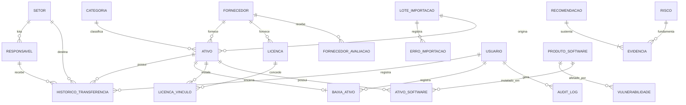

# Modelo de Dados — Diagrama de Entidade-Relacionamento

Parte de [Modelo de Dados — ITAM](README.md).

## 1. Diagrama de Entidade-Relacionamento

A cardinalidade `RECOMENDACAO ||--|{ EVIDENCIA` é **um para um-ou-muitos**, não um para zero-ou-muitos. Essa é a expressão no modelo da regra BR-027: recomendação sem evidência não existe.

